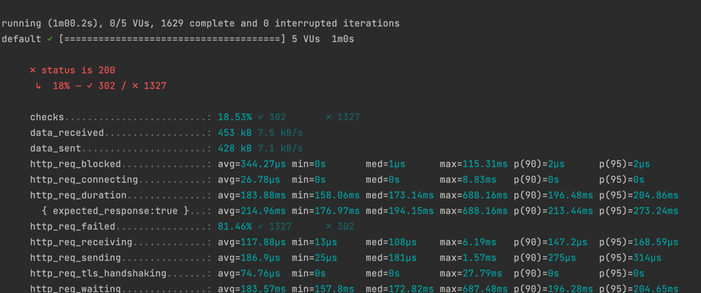

# K6 Load Test Task Implementation


#### Task 
```text 
Implemet load test scenario on the “sync/v2/content/text” endpoint 
 - Load of exactly 5 req/sec
 - Donʼt use the same text over and over for the load test
 - Create a dataset that simulates the real world and use it as your input 
```

As a part of this example task I used k6 open source tool for Mac

```bash
brew install k6
```

### Execution

Navigate to Tests/LoadTests directory, and replace <your_api_key> placeholder with the real API key for proper 
authentication:

```javascript
const params = {
    headers: {
        'af-api-key':"<your_api_key>"
    }}
```

Inside of load_test_script.js file there are three separate arrays of data which represents 'text', 'title' 
and 'description'
```javascript
const testTitles, const testDescriptions, const testText
```
This data is getting inside randomly for each test execution, as well as a 'content_id', which is getting as a 
random int.

This test scenario was configured to use a load of 5 VUs per second with the duration of 1 minute.

```javascript
export let options = {
    vus: 5,
    vusMax: 5,
    duration: "1m"
}
```

The function itself is presented like this 
```javascript
export default function () {
    const url = ''
    const payload = {}
}
```


Test succession criteria is configured as follows 

```javascript
const checkRes = check(res, {
      'status is 200':(r)=> r.status === 200
  });
```

To execute this test, navigate to the directory with test script and run the following command

```bash
 k6 run --linger load_test_script.js
 ```

Example of test output:

### Example result




