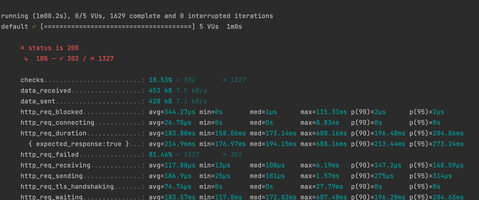

# NOTE: Temporary outdated. Currently refactoring..

## Python API Test Implementation

### Description 

Tool for testing endpoints. At the moment implementation is based on free ones, that 
does not require authorization. Auth tests coming soon.

### Installation 

In order to execute the tests you need to install Python3 on your machine, then navigate to root project folder and 
execute the following command 

```bash
pip install requirements.txt
```

### Execution


To execute tests from the root folder run the following command for one of presented test files

```bash
python3 -m unittest Tests/test_file_name.py

```
(or if you're running under virtual env)

```bash
python -m unittest Tests/test_file_name.py

```


### Details

In order to see what each test is doing you may refer to separate tests name.
For example, the following test verifies, that for request with proper data and api key for specified endpoint 
should receive status code 200 OK

```python
def test__get_cat_facts_response_200(): pass
```

## K6 Load Test Challenge Implementation


### --- IMPORTANT NOTE: --- 

This test was a part of a challenge task, but no longer required. So for now test literally does 
nothing, but the purpose was to test specific endpoint, by sending random data sequence within specified time 
period. So if your endpoint requires accepts similar AUTH type and data, you can use 
it for your purposes.

New implementation coming soon.
### --- IMPORTANT NOTE! ---

As a part of this example challenge I used k6 open source tool for Mac

```bash
brew install k6
```

### Execution

Navigate to Tests/LoadTests directory, open load_test_script.js file, and replace <your_api_key> placeholder with the real API key for proper 
authentication:

```javascript
const params = {
    headers: {
        'af-api-key':"<your_api_key>"
    }}
```

Inside of load_test_script.js file there are three separate arrays of data which represents 'text', 'title' 
and 'description'
```javascript
const testTitles, const testDescriptions, const testText
```
This data is getting inside randomly for each test execution, as well as a 'content_id', which is getting as a 
random int.

This test scenario was configured to use a load of 5 VUs per second with the duration of 1 minute.

```javascript
export let options = {
    vus: 5,
    vusMax: 5,
    duration: "1m"
}
```

The function itself is presented like this 
```javascript
export default function () {
    const url = ''
    const payload = {}
}
```


Test succession criteria is configured as follows 

```javascript
const checkRes = check(res, {
      'status is 200':(r)=> r.status === 200
  });
```

To execute this test, navigate to the directory with test script and run the following command

```bash
 k6 run --linger load_test_script.js
 ```

Example of test output:

### Example result




